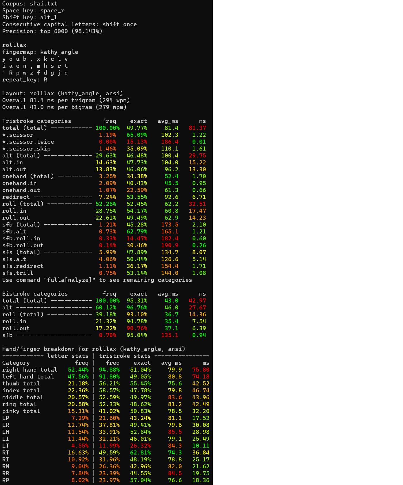

# Tanamr's layouts

Many of the layouts developed by [trialyzer](https://github.com/samuelxyz/trialyzer) are rather strange. However, now and then a few of them look like they might actually be good. I may also end up making layouts by other means, and those will be included here as well if I deem them sufficiently noteworthy.

These layouts may be subject to change; any changes will be indicated if they occur.

# ints

```
f o u m j  q g d p ,
 h a e r x  v s t n i
  ' / l w z  y c k b .
```

This layout is designed for a row-staggered board with angle mod. Preferably, the right thumb should be used for spacebar. 

Notable characteristics:
- High rolls, majority inward.
- Unusually high onehands, extremely inward (2.4 inward ratio, increases to 3.3 when adding space on the right thumb).
- High redirects, though only slightly higher than Colemak.
- Low alternation.
- Low lateral stretching and reasonably low dsfb.
- Index finger keys can optionally support alt fingering and/or sliding to remove same finger sequences, such as `rm`, `wl`, `sys`, `cyc`, `gs`, `sc`.

This layout is tricky to obtain in a non-angle-modded format. (Cycling `z` to the left end of the bottom row causes `w` to get a bad position, so more keys must be rearranged.)

## genkey stats

Statistics from [semi's genkey analyzer](https://github.com/semilin/genkey) using the `-stagger` flag.

```
ints
f o u m j  q g d p ,
h a e r x  v s t n i
' / l w z  y c k b .
Rolls (l): 30.10%
        Inward: ~19.03%
        Outward: ~11.07%
Rolls (r): 20.78%
        Inward: ~12.59%
        Outward: ~8.19%
Alternates: ~21.61%
Onehands: ~6.43%
Redirects: ~12.21%
Finger Speed (weighted): [0.12 2.05 1.12 4.66 3.39 0.71 0.74 1.19]
Finger Speed (unweighted): [0.18 7.38 5.37 25.65 18.63 3.40 2.65 1.79]
Highest Speed (weighted): 4.66 (LI)
Highest Speed (unweighted): 25.65 (LI)
Index Usage: 14.9% 14.7%
SFBs: 0.911%
DSFBs: 6.627%
LSBs: 0.58%
Top SFBs:
        sc 0.138%       rm 0.136%       ue 0.129%   ys 0.105%
        rl 0.077%       oa 0.075%       gs 0.061%   sy 0.049%

Worst Bigrams:
        ml 21.358       rl 18.368       oa 16.790   ue 14.676
        sy 14.467       sc 11.290       o' 10.904   mr 10.294
```

## Changelog

2022-04-20: Rearranged keys on the index fingers to improve `wl` `'l` `ky` `cy`, add `gs` slide, and avoid `xc`. Also flipped `bp` to reduce bottom ring usage. Main drawback is possibly reduced comfort of `ing`.
Previous version:

```
f o u l q  x y d b ,
 h a e r j  v s t n i
  ' / w m z  g c k p .
```

# seht-drai

```
f u l v b  ; g n o j 
 s e h t k  z d r a i .
  ' m p w q  y c x / , 
```

This layout is designed for a row-staggered board with angle mod. 

Notable characteristics:
- Incredibly frequent onehands, including the most common trigrams such as `the`, `and`, `ing`, `ion`
- Rolls tend to be leftward, interestingly.
- Low sfb and dsfb stats.
- Redirect levels comparable to Colemak.
- Low alternation.
- The left ring and pinky may be a problem point (imagine typing `useful`).

If you really want a non-angle-modded version, try cycling `z` to the bottom left and moving `q` to where `z` currently is.

## genkey stats

Statistics from [semi's genkey analyzer](https://github.com/semilin/genkey) using the `-stagger` flag.

```
seht-drai
f u l v b  ; g n o j
s e h t k  z d r a i .
' m p w q  y c x / ,
Rolls (l): 23.00%
        Inward: ~7.82%
        Outward: ~15.18%
Rolls (r): 25.08%
        Inward: ~16.19%
        Outward: ~8.89%
Alternates: ~22.10%
Onehands: ~10.09%
Redirects: ~11.10%
Finger Speed (weighted): [0.64 2.49 2.25 3.47 1.80 1.19 1.23 1.50]
Finger Speed (unweighted): [0.96 8.97 10.79 19.11 9.88 5.72 4.44 2.24]
Highest Speed (weighted): 3.47 (LI)
Highest Speed (unweighted): 19.11 (LI)
Index Usage: 16.3% 10.9%
SFBs: 0.776%
DSFBs: 6.035%
LSBs: 0.67%
Top SFBs:
        rn 0.137%       ue 0.129%       pt 0.078%       tw 0.075%
        oa 0.075%       dy 0.049%       e' 0.048%       cy 0.032%

Worst Bigrams:
        lm 24.472       ue 19.568       oa 16.790       nr 16.162
        tp 15.416       i. 11.352       e' 10.620       bt 9.998
```

# rollla

```
y o u b .  x k c l v
 i a e n ,  m h s r t
  ' / p w z  f d g j q
```

This layout is a mod of [the rolll layout by Semi](https://semilin.github.io/other_layouts.html#org017c395), and was developed in collaboration with [<3](https://github.com/mindhatch) and trialyzer. It introduces angle mod and reduces same-finger and lateral-stretch frequency compared to the original rolll layout.

Rollla is designed for a row-staggered board with angle mod. Preferably, the right thumb should be used for space. Notable characteristics:
- Low dsfb (better than vanilla semimak) and fairly low sfb.
- Plenty of rolls, especially inward rolls.
- Very reasonable redirect frequency considering the level of rolls and onehands.
- Moderate alternation.
- T on the pinky may be intimidatingly high frequency, but the movement on that pinky is actually very low.

## genkey stats

Statistics from [semi's genkey analyzer](https://github.com/semilin/genkey) using the `-stagger` flag.

```
rollla
y o u b .  x k c l v
i a e n ,  m h s r t
' / p w z  f d g j q
Rolls (l): 28.05%
        Inward: ~17.67%
        Outward: ~10.38%
Rolls (r): 17.81%
        Inward: ~11.22%
        Outward: ~6.59%
Alternates: ~37.17%
Onehands: ~2.48%
Redirects: ~5.88%
Finger Speed (weighted): [0.85 2.05 1.12 3.88 1.53 1.39 0.87 0.54]
Finger Speed (unweighted): [1.28 7.38 5.37 21.33 8.42 6.69 3.13 0.81]
Highest Speed (weighted): 3.88 (LI)
Highest Speed (unweighted): 21.33 (LI)
Index Usage: 14.4% 13.8%
SFBs: 0.864%
DSFBs: 5.554%
LSBs: 0.54%
Top SFBs:
        sc 0.138%       ue 0.129%       n. 0.094%       n, 0.094%
        wn 0.084%       rl 0.077%       oa 0.075%       gs 0.061%

Worst Bigrams:
        oa 16.790       ue 14.676       yi 12.966       cs 12.937
        lr 11.828       .n 10.912       o' 10.904       .p 8.939
```

# rolllax

```
y o u b .  x k c l v
 i a e n ,  m h s r t
  ' R p w z  f d g j q
```

A variant of rollla (see above) but with the `/` replaced by a repeat key - this is indicated by the position marked `R`, and is pressed with the left thumb. A repeat key simply duplicates the previous letter, which essentially eliminates double-tapping, thereby reducing finger movement and strain. Since double letters make up about 2.5% of bigrams, this may be a significant gain. Trialyzer data shows that double letters are nearly as slow as sfbs.

This is the layout I currently use. The layout is called rollax because the repeat key is on what would be `x` in QWERTY. Pressing it with the left thumb may sound extreme, but seems to actually work quite well.

## trialyzer stats

Genkey does not support repeat keys and also does not support thumb keys. Therefore, in place of the genkey stats, below are the statistics from my copy of trialyzer reflecting the way I currently use the layout. 

Note that in the image, space and shift are included in the stats. Trialyzer also uses [slightly different definitions](https://github.com/samuelxyz/trialyzer/wiki/Nstroke-categories) of the statistics compared to genkey. The numbers are therefore different from what one may expect.


