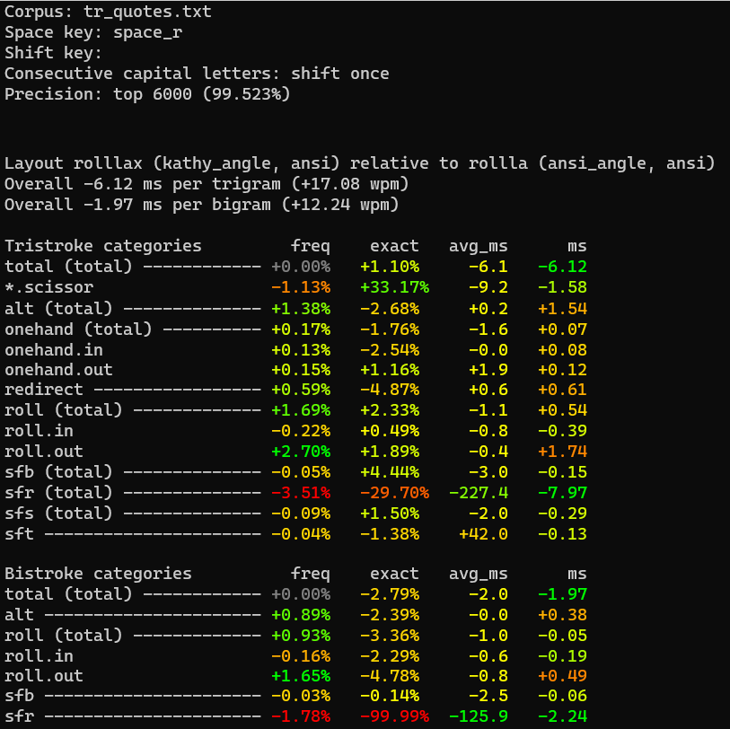

# Tanamr's layouts

Many of the layouts developed by [trialyzer](https://github.com/samuelxyz/trialyzer) are rather strange. However, now and then a few of them look like they might actually be good. I may also end up making layouts by other means, and those will be included here as well if I deem them sufficiently noteworthy.

These layouts may be subject to change; any changes will be indicated if they occur.

# enouf

```
q r a , z  f w l d v
e n o u .  g c h t s
j x ' i /  p y m k b
```

This layout is for the brave. Due to the right index being completely packed with moderately-common consonants, it is probably better to use this with a column-staggered board (`f` in is in a bad spot for row stagger).

Features:
- Low sfb, extremely low dsfb
- High rolls, frequent onehands such as `ion`, `one`, `are`, `ine`
- Reasonable redirect level, though beware of no-index redirects such as `rea`/`ear` and (less frequent, but worse) `ean`/`nea`.
- Some weird scissory movements such as `'r`, `wh`, and your typical `or`/`an` half-scissors with this kind of rn/oa interaction.
- Vaguely low-ish lateral stretching
- Busy pinkies

Tips:
- Using a repeat key would be helpful to remove `ee` double-taps on the pinky. 
- Applying angle mod is... not great, not terrible.
- If a 2-row change between the middle and index finger (like `ai, ly`) is not good for you, you will probably want to rearrange the indexes. Good luck.
- Swapping `f` with `v` gives you the original `enou`. This increases pinky load, and makes it even harder to type `sfb` if you are someone who talks about keyboard layouts a lot. However, in return you get the lowest genkey-weighted dsfb count ever seen, and a slightly less common letter in that top index corner.

## genkey stats

```
enouf
q r a , z  f w l d v
e n o u .  g c h t s
j x ' i /  p y m k b
Rolls (l): 33.10%
        Inward: ~15.69%
        Outward: ~17.41%
Rolls (r): 17.85%
        Inward: ~10.50%
        Outward: ~7.35%
Alternates: ~30.76%
Onehands: ~3.59%
Redirects: ~6.25%
Finger Speed (weighted): [2.05 2.02 1.61 2.74 2.71 2.07 1.28 2.54]
Finger Speed (unweighted): [3.07 7.28 7.73 15.09 14.89 9.93 4.62 3.81]
Highest Speed (weighted): 2.74 (LI)
Highest Speed (unweighted): 15.09 (LI)
Index Usage: 12.3% 13.1%
SFBs: 0.686%
DSFBs: 5.523%
LSBs: 0.97%
Top SFBs:
        rn 0.137%       ui 0.107%       oa 0.075%       iz 0.056%
        eq 0.039%       bs 0.039%       je 0.039%       cy 0.032%

Worst Bigrams:
        rn 25.352       lm 18.964       ee 18.648       sb 15.422
        ao 14.814       zi 12.812       ui 10.400       ss 9.661
```

# ints

```
f o u m j  q g d p ,
 h a e r x  v s t n i
  ' / l w z  y c k b .
```

This layout is designed for a row-staggered board with angle mod. Preferably, the right thumb should press space. 

Notable characteristics:
- High rolls, majority inward.
- Unusually high onehands, extremely inward (2.4 inward ratio, increases to 3.3 when adding space on the right thumb).
- High redirects, though only slightly higher than Colemak.
- Low alternation.
- Low lateral stretching and reasonably low dsfb.
- Index finger keys can optionally support alt fingering and/or sliding to remove same finger sequences, such as `rm`, `wl`, `sys`, `cyc`, `gs`, `sc`.

This layout is tricky to obtain in a non-angle-modded format. (Cycling `z` to the left end of the bottom row causes `w` to get a bad position, so you have to either rearrange more keys, or just cope.)

## genkey stats

Statistics from [semi's genkey analyzer](https://github.com/semilin/genkey) using the `-stagger` flag.

```
ints
f o u m j  q g d p ,
h a e r x  v s t n i
' / l w z  y c k b .
Rolls (l): 30.10%
        Inward: ~19.03%
        Outward: ~11.07%
Rolls (r): 20.78%
        Inward: ~12.59%
        Outward: ~8.19%
Alternates: ~21.61%
Onehands: ~6.43%
Redirects: ~12.21%
Finger Speed (weighted): [0.12 2.05 1.12 4.66 3.39 0.71 0.74 1.19]
Finger Speed (unweighted): [0.18 7.38 5.37 25.65 18.63 3.40 2.65 1.79]
Highest Speed (weighted): 4.66 (LI)
Highest Speed (unweighted): 25.65 (LI)
Index Usage: 14.9% 14.7%
SFBs: 0.911%
DSFBs: 6.627%
LSBs: 0.58%
Top SFBs:
        sc 0.138%       rm 0.136%       ue 0.129%   ys 0.105%
        rl 0.077%       oa 0.075%       gs 0.061%   sy 0.049%

Worst Bigrams:
        ml 21.358       rl 18.368       oa 16.790   ue 14.676
        sy 14.467       sc 11.290       o' 10.904   mr 10.294
```

## Changelog

2022-04-20: Rearranged keys on the index fingers to improve `wl` `'l` `ky` `cy`, add `gs` slide, and avoid `xc`. Also flipped `bp` to reduce bottom ring usage. Main drawback is possibly reduced comfort of `ing`.
Previous version:

```
f o u l q  x y d b ,
 h a e r j  v s t n i
  ' / w m z  g c k p .
```

# rollla

```
y o u b .  x k c l v
 i a e n ,  m h s r t
  ' / p w z  f d g j q
```

This layout is a mod of [the rolll layout by Semi](https://semilin.github.io/other_layouts.html#org017c395), and was developed in collaboration with [<3](https://github.com/mindhatch) and trialyzer. It introduces angle mod and reduces same-finger and lateral-stretch frequency compared to the original rolll layout.

Rollla is designed for a row-staggered board with angle mod. Preferably, the right thumb should be used for space. Notable characteristics:
- Low dsfb (better than vanilla semimak) and fairly low sfb. Low lateral stretching.
- Plenty of rolls, especially inward rolls.
- Very reasonable redirect frequency considering the level of rolls and onehands.
- Moderate alternation.
- T on the pinky may be intimidatingly high frequency, but the movement on that pinky is actually very low.

Rollla rollla rollla!

## genkey stats

Statistics from [semi's genkey analyzer](https://github.com/semilin/genkey) using the `-stagger` flag.

```
rollla
y o u b .  x k c l v
i a e n ,  m h s r t
' / p w z  f d g j q
Rolls (l): 28.05%
        Inward: ~17.67%
        Outward: ~10.38%
Rolls (r): 17.81%
        Inward: ~11.22%
        Outward: ~6.59%
Alternates: ~37.17%
Onehands: ~2.48%
Redirects: ~5.88%
Finger Speed (weighted): [0.85 2.05 1.12 3.88 1.53 1.39 0.87 0.54]
Finger Speed (unweighted): [1.28 7.38 5.37 21.33 8.42 6.69 3.13 0.81]
Highest Speed (weighted): 3.88 (LI)
Highest Speed (unweighted): 21.33 (LI)
Index Usage: 14.4% 13.8%
SFBs: 0.864%
DSFBs: 5.554%
LSBs: 0.54%
Top SFBs:
        sc 0.138%       ue 0.129%       n. 0.094%       n, 0.094%
        wn 0.084%       rl 0.077%       oa 0.075%       gs 0.061%

Worst Bigrams:
        oa 16.790       ue 14.676       yi 12.966       cs 12.937
        lr 11.828       .n 10.912       o' 10.904       .p 8.939
```

# rolllax

```
y o u b .  x k c l v
 i a e n ,  m h s r t
  ' R p w z  f d g j q
```

A variant of rollla (see above) but with the `/` replaced by a repeat key - this is indicated by the position marked `R`, and is pressed with the left thumb. A repeat key simply duplicates the previous letter, which essentially eliminates double-tapping, thereby reducing finger movement and strain. Since double letters make up about 2.5% of bigrams, this may be a significant gain. Trialyzer data shows that double letters are nearly as slow as sfbs.

This is the layout I currently use. The layout is called rolllax because the repeat key is on what would be `x` in QWERTY. Pressing it with the left thumb may sound extreme, but seems to actually work quite well.

## trialyzer stats

Genkey does not support repeat keys and also does not support thumb keys. Therefore, in place of the genkey stats, below are some statistics (edited for brevity) from my copy of trialyzer, including (weighted) typing speed data. This shows the _difference_ in stats when moving from rollla to rolllax. Note that the `sfr` category has been completely wiped out by the repeat key, resulting in a substantial stats improvement.



# seht-drai

```
f u l v b  q g n o j 
 s e h t k  ' d r a i .
  ; m p w z  y c x / , 
```

This layout is designed for a row-staggered board with angle mod. Preferably, the right thumb should press space.

Notable characteristics:
- Incredibly frequent onehands, including the most common trigrams such as `the`, `and`, `ing`, `ion`
- Rolls tend to be leftward, interestingly.
- Low sfb, dsfb, and lateral stretching.
- Redirect levels comparable to Colemak.
- Low alternation.
- Based on a test drive, the main problem points are on the left hand: imagine typing `useful`, or `lemurs`.

For a non-angle-modded version, try cycling `z` to the bottom left. You may want to also swap `w` with `k`, and `y` with `'`, to get those more common letters out of the corners, especially for non-row-staggered boards.

## genkey stats

Statistics from [semi's genkey analyzer](https://github.com/semilin/genkey) using the `-stagger` flag.

```
seht-drai
f u l v b  q g n o j
s e h t k  ' d r a i .
; m p w z  y c x / ,
Rolls (l): 22.69%
        Inward: ~7.64%
        Outward: ~15.06%
Rolls (r): 25.25%
        Inward: ~16.35%
        Outward: ~8.90%
Alternates: ~22.49%
Onehands: ~10.07%
Redirects: ~10.94%
Finger Speed (weighted): [1.48 2.20 2.70 3.97 2.20 1.51 1.68 1.96]
Finger Speed (unweighted): [2.22 7.91 12.97 21.81 12.10 7.27 6.06 2.95]
Highest Speed (weighted): 3.97 (LI)
Highest Speed (unweighted): 21.81 (LI)
Index Usage: 16.3% 11.2%
SFBs: 0.764%
DSFBs: 5.978%
LSBs: 0.77%
Top SFBs:
        rn 0.137%       ue 0.129%       pt 0.078%       tw 0.075%
        oa 0.075%       dy 0.049%       cy 0.032%       dg 0.026%

Worst Bigrams:
        lm 25.285       ue 23.021       oa 19.752       nr 19.014
        tp 16.562       i. 12.791       bt 10.741       fs 10.397
```

## amini stats

Using the AKL discord server's [amini analyzer](https://github.com/Apsu/cmini), the combined MonkeyType/TypeRacer quotes corpus shows a striking onehand/redirect ratio:

```
seht-drai (Tanamr)
  f u l v b  q g n o j  
  s e h t k  ' d r a i .
   ; m p w z  y c x / ,  

MONKEYRACER:
  Alt: 17.09%
  Rol: 46.17%   (In/Out: 22.29% | 23.88%)
  One:  9.83%   (In/Out:  5.20% |  4.63%)
  Red:  6.46%   (Bad:     1.40%)

  SFB: 0.80%
  SFS: 4.72%

  LH/RH: 51.41% | 48.59%
```

(This was from the time when amini included thumb space in the statistics.)

## Changelog

2023-03-17: Swapped `q` and `z` between hands to improve `qu` and slightly lower same-finger stats. Cycled punctuation to improve `'`. Previous version:

```
f u l v b  ; g n o j 
 s e h t k  z d r a i .
  ' m p w q  y c x / , 
```

# seht-frai and seht-yfrai

These layouts are a lot like seht-drai, but with `m` and `f` moved to fix some awkward redirects and scissoring movements on the left hand. `seht-frai` has a `yi` pinky. `seht-yfrai` moves `y` to the index finger, reducing pinky load but adding a smidge more LSB. Both layouts lose the `and` onehand, and have slightly more LSB than `seht-drai`.

These layouts are designed without angle mod. Applying angle mod doesn't add a huge amount of extra sfb to the left index, but it does add yet more load to that finger, which is already the busiest finger. Genkey suggests swapping `m` and `k` to reduce movement.

```
seht-frai
b u l w z  ' g n o y
s e h t m  , f r a i ;
v / . d k  p c x q j

seht-yfrai
b u l w z  ' g n o ,
s e h t m  y f r a i ;
v / . d k  p c x q j
```

## genkey stats

Statistics from [semi's genkey analyzer](https://github.com/semilin/genkey).

```
seht-frai
b u l w z  ' g n o y
s e h t m  , f r a i ;
v / . d k  p c x q j
Rolls (l): 21.96%
        Inward: ~9.05%
        Outward: ~12.91%
Rolls (r): 25.35%
        Inward: ~16.84%
        Outward: ~8.51%
Alternates: ~23.18%
Onehands: ~9.07%
Redirects: ~12.06%
Finger Speed (weighted): [2.53 2.08 1.47 3.45 2.15 1.51 1.61 1.70]
Finger Speed (unweighted): [3.80 7.48 7.04 18.96 11.80 7.27 5.80 2.55]
Highest Speed (weighted): 3.45 (LI)
Highest Speed (unweighted): 18.96 (LI)
Index Usage: 17.7% 10.8%
SFBs: 0.723%
DSFBs: 6.193%
LSBs: 0.79%
Top SFBs:
        rn 0.137%       ue 0.129%       tw 0.075%       oa 0.075%
        g, 0.043%       l. 0.042%       bs 0.039%       yi 0.037%

Worst Bigrams:
        ue 23.021       oa 19.752       nr 19.014       bs 15.422
        yi 15.255       l. 11.551       tm 10.952       ss 9.661

seht-yfrai
b u l w z  ' g n o ,
s e h t m  y f r a i ;
v / . d k  p c x q j
Rolls (l): 21.96%
        Inward: ~9.05%
        Outward: ~12.91%
Rolls (r): 25.28%
        Inward: ~16.73%
        Outward: ~8.55%
Alternates: ~23.18%
Onehands: ~9.13%
Redirects: ~12.02%
Finger Speed (weighted): [2.53 2.08 1.47 3.45 2.33 1.51 1.61 1.06]
Finger Speed (unweighted): [3.80 7.48 7.04 18.96 12.83 7.27 5.80 1.58]
Highest Speed (weighted): 3.45 (LI)
Highest Speed (unweighted): 18.96 (LI)
Index Usage: 17.7% 11.7%
SFBs: 0.725%
DSFBs: 6.200%
LSBs: 0.94%
Top SFBs:
        rn 0.137%       ue 0.129%       tw 0.075%       oa 0.075%
        l. 0.042%       bs 0.039%       cy 0.032%       tm 0.028%

Worst Bigrams:
        ue 23.021       oa 19.752       nr 19.014       bs 15.422
        l. 11.551       tm 10.952       ss 9.661        sv 9.557

```
